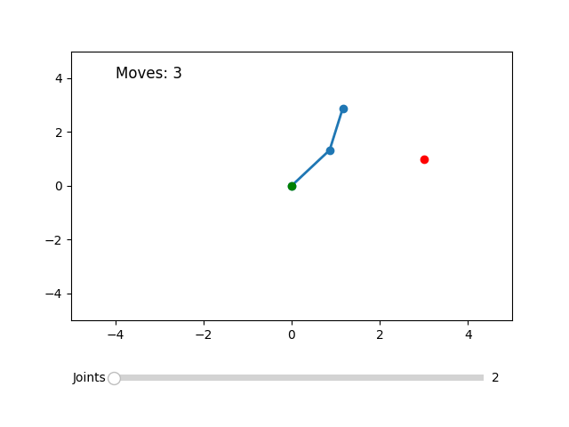

# Kinematic Arm Simulation

This project is a simulation of a kinematic arm with adjustable joints and dynamic link lengths. The arm attempts to reach a movable target using inverse kinematics. The simulation includes interactive features such as a slider to control the number of joints and a click event to move the target within the workspace.

## Features
- **Dynamic Joint Control:** Adjust the number of joints between 2 and 5 using a slider.
- **Target Interaction:** Click anywhere in the plot area to set a new target position.
- **Adaptive Link Lengths:** The arm automatically adjusts link lengths based on the target's distance.
- **Movement Counter:** Displays the number of movements taken to reach the target.

## Requirements
- Python 3.12+
- `matplotlib`
- `numpy`

## Installation
1. Clone the repository:
   ```bash
   git clone https://github.com/gitcero/kinematic-arm-simulation.git
   cd kinematic-arm-simulation
   ```
2. Create a virtual environment:
   ```bash
   python3 -m venv .venv
   source .venv/bin/activate
   ```
3. Install dependencies:
   ```bash
   pip install matplotlib numpy
   ```

## Usage
Run the simulation using:
```bash
python src/main.py
```

## How It Works
1. The arm starts with a default number of joints and link lengths.
2. Adjust the number of joints using the slider.
3. Click anywhere on the plot to set a new target.
4. The arm will attempt to reach the target using inverse kinematics.

## Simulation Preview


## License
This project is licensed under the MIT License.